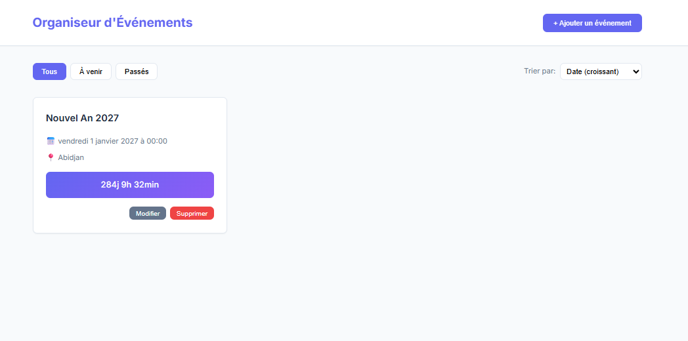

# Event_Organizer

## Description
Application web permettant de créer, organiser et gérer des événements avec date, heure et lieu.  
Ce projet est le **trentième** du défi personnel **100 projets en 2026**.

---

## Objectifs du projet
- Implémenter un CRUD complet
- Manipuler des dates et heures
- Trier et organiser des événements
- Structurer une interface type dashboard
- Améliorer la gestion des données temporelles

---

## Plateforme
- Web (navigateur)

---

## Technologies utilisées
- HTML
- CSS
- JavaScript (Vanilla)
- LocalStorage

---

## Fonctionnalités
- Ajout d’un événement :
  - Titre
  - Date
  - Heure
  - Lieu
  - Description (optionnel)
- Affichage de la liste des événements
- Tri automatique par date
- Suppression d’un événement
- Sauvegarde locale des données

---

## Design & UX
- Interface claire et structurée
- Événements affichés sous forme de cartes ou liste
- Dates mises en évidence
- Bouton d’ajout visible et accessible
- Responsive (mobile et desktop)

---

## Captures d’écran

---

## Ce que j’ai appris
- Manipulation avancée des dates en JavaScript
- Tri de données dynamiques
- Implémentation d’un CRUD complet
- Organisation d’un mini dashboard
- Amélioration de l’expérience utilisateur

---

## Améliorations possibles
- Édition d’un événement
- Filtre événements passés / à venir
- Compte à rebours pour chaque événement
- Vue calendrier
- Mode sombre

---

## Statut du projet
 **Projet terminé**